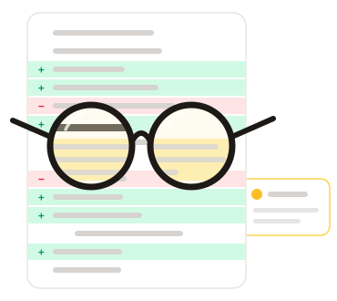

# Spec-Tackle

<p align="center">
  <picture>
    <source media="(prefers-color-scheme: dark)" srcset="docs/spectacles-dark.svg">
    
  </picture>
</p>

A reviewer-oriented reading view for GitHub pull requests, built for spec and design-doc PRs.

Run it straight from GitHub, no clone needed:

```bash
uvx --from git+https://github.com/dimagi/spec-tackle spec-tackle
```

To also turn on [Ask Claude](#what-you-get), run this instead. It needs [Claude Code](https://claude.com/claude-code) installed and signed in:

```bash
uvx --from 'spec-tackle[claude] @ git+https://github.com/dimagi/spec-tackle' spec-tackle
```

Without the `[claude]` extra, Ask Claude is hidden in the page and can't be turned on from there; restart with the command above.

uv caches the build. Add `--refresh` to pick up new commits, or append `@<tag>` / `@<commit>` to the URL to pin a version.

From a local clone:

```bash
uv sync --extra claude   # leave out --extra claude to run without Ask Claude
uv run spec-tackle https://github.com/dimagi/commcare-connect/pull/1569/changes
```

A plain `uv sync` removes the Claude extra, which turns Ask Claude off.

Opens `http://127.0.0.1:8765`. It authenticates with `GITHUB_TOKEN`/`GH_TOKEN`, or falls back to `gh auth token`. If you're not signed in, the page offers **Sign in with GitHub** (via the GitHub CLI) or lets you paste a token.

## What you get

- **Readable document**: markdown is rendered as a page with a serif body, an outline and scroll-spy. Diagrams in Mermaid code blocks are drawn as diagrams. Images work in private repos too. Code and other non-markdown files show as diffs.
- **Comments in the margin**: review threads sit next to the passage they discuss, and that passage is highlighted. Click either one to focus the other.
- **Comment anywhere**: hover a block and click **+**, or select text and press **c**. Comments post straight to the PR as review comments. If the text didn't change in the PR, GitHub won't accept a line comment there, so the composer says so and posts a file comment that names the lines.
- **Reply, resolve or reopen** threads. Reply drafts are saved locally.
- **Light / dark / system theme** toggle in the top bar (defaults to light, remembered per browser).
- **Live**: the page checks GitHub every 30 seconds. New comments are flagged and announced, and the tab title shows an unread count. You're told when new commits land.
- **Reviewer tools**: Open/All filter, hide bot comments, open-thread counts per section, `j`/`k` to jump between open threads, a PR switcher on the title (or `p`) listing PRs awaiting your review and ones you opened recently, and a **Finish review** button (Comment / Approve / Request changes).
- **Modified specs**: changed blocks get a green marker, with a **Document ↔ Changes** toggle.
- **Ask Claude (private)**: switch the composer to **Ask Claude**, or select text and press **a**, to ask Claude about a passage. Claude sees the whole PR (description, diffs, every comment) and can read the repo at the PR's commit. Questions and answers stay on your machine and are never posted. Needs [Claude Code](https://claude.com/claude-code) installed and signed in, and spec-tackle started with the `claude` extra (see the commands at the top).

## Development

```bash
uv sync --extra claude   # optional, enables Ask Claude
uv run pytest
```

Local state (saved drafts, Ask Claude threads, repo checkouts) lives in `~/.local/share/spec-tackle/`.

FastAPI JSON API (`src/spec_tackle/app.py`, page data in `pages.py`), GitHub GraphQL/REST client (`github.py`), markdown→line-mapped HTML (`render.py`). The UI is React + TypeScript + Tailwind in `frontend/`, built into `src/spec_tackle/static/dist/`. The build is committed, so installing spec-tackle needs no Node.

Working on the UI (needs Node 20+):

```bash
cd frontend
npm install
npm run dev        # Vite on :5173, proxying the API to spec-tackle on :8765
npm test           # unit and component tests
npm run e2e        # Playwright checks against a fake GitHub
npm run build      # rebuild the committed bundle; `uv run pytest` fails if you forget
```
